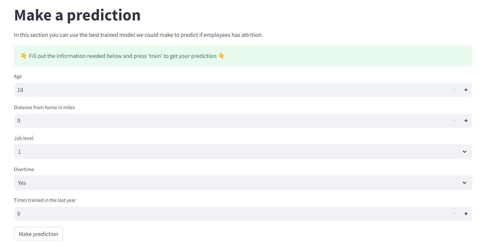

# Brainstorm for Training program algorythm

##

### Background

We want to create an algorythm that uses the decision tree model, to help the user via Streamlit, to acces and choose different exercises for their training program.

we want a structure that looks like this:

with options like:

- Starting weight
- end goal
- Intensity
- hours of training per week
- current training level
  - beginner (25*kg = max calories burned per week)
  - intermidiate ( 35*kg = max calories burned per week)
  - trainned ( 45*kg = max calories burned per week)

The model should then predict how much weight the user should have lost if they trained for 1 month, 6 month and 1 year.

we use the exercise_dataset.csv for reference

500 calories defiant per day, in 2 weeks is 1 kg lost ( 7000 calories = 1 kg)
