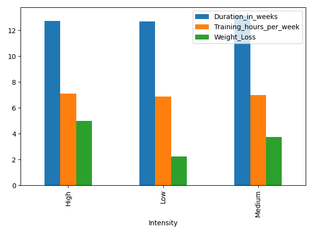
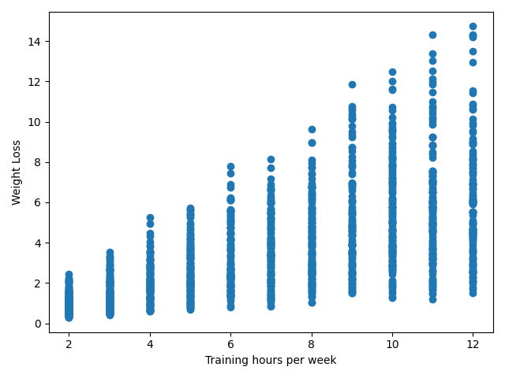
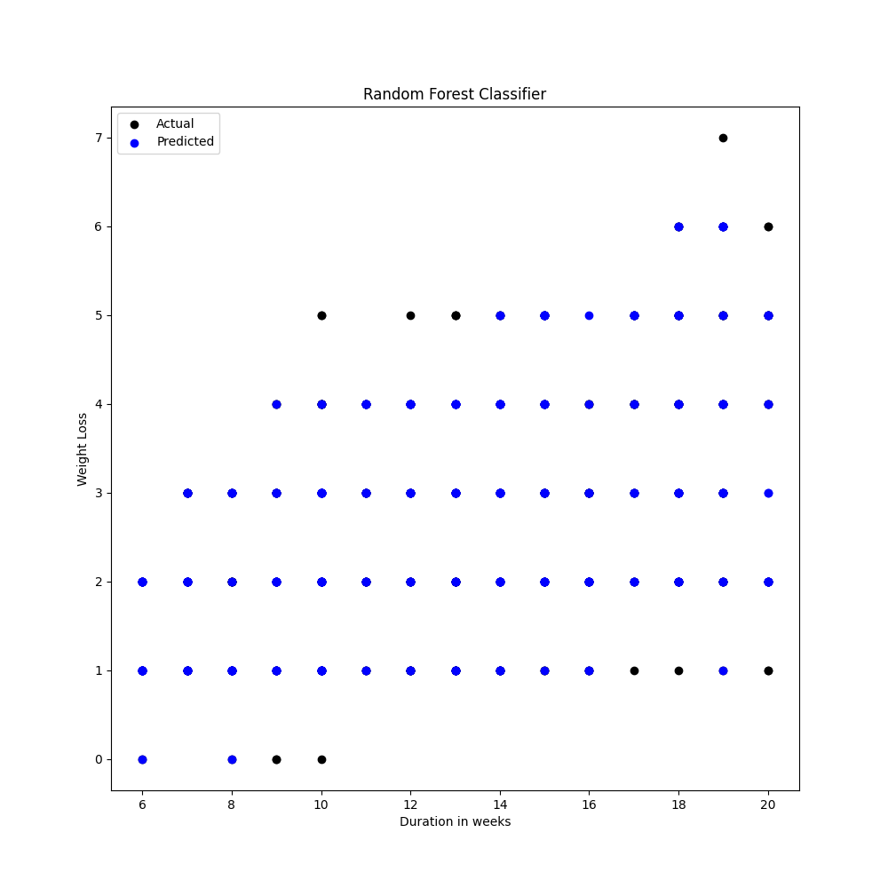
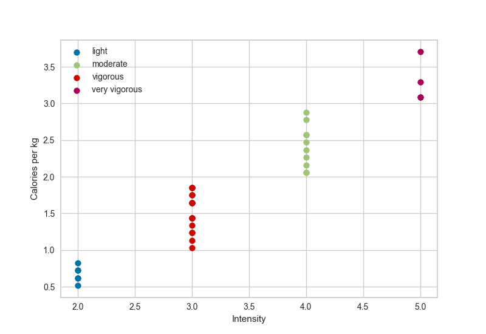

# ExamProjectBI

### Implementation instructions:
1. Download or clone the project
2. Run "pip install -r requirements.txt" in the root of the project
3. run "streamlit run app.py"

### Problem Statement:
 How can BI and AI be leveraged to develop a personalized fitness training program for individuals, 
 and give an estimate of the possible weight loss?
1. How does an individual determine the amount of weight they will lose based on their training schedule?
2. In the absence of personal trainers and fitness expertise, 
what methods can individuals utilize to develop an effective training program?
3. What statistical data sources exist to evaluate the efficacy of different exercises for weight loss?
4. How can a personalized training program account for individual differences in intensity preferences and time availability?
5. What role does goal-setting play in fitness training, and how can individuals determine the achievability of their goals?

### Motivation:
Weight loss is difficult for many people around the world, and as the world population becomes heavier and heavier, 
we want to address the problem with a program that can predict the weight loss that individuals can have with certain training hours, 
intensity, starting weight etc, making it easier for people to set realistic goals and determine what kind of training is best.

### Theoretical Foundation:
We are using Python as the programming language and anaconda as interpreter.
We have used several models for training and predicting data.
1. linear, multilinear, polynomiel regression, random forest classifier, Naive Bayes (supervised machine learning)
2. k-Means, HierarchicalClustering (un-supervised training)
3. Text vectorisation techniques: TF-IDF and Word Embedding

### Argumentation of Choices:
For the supervised training we started by testing which of the models gave the best accuracy. For Regression it was the R-Squared score.
And used the one with the highest score. The score is a percentage, the Higher the percentage the better.
We concluded that classification was not the best way for predicting weight loss, as it defines classes and not numerical values.

For the un-supervised training we based the choice on the silhouette score.
the score varies from (-1 to 1) the closer we get to 1 the better is the score.
### Design:
We decided to split the different aspects of the project into different folders. 
#### examples: Code, Data, Documentation/Graphs, Media, Model, pages.
#### Code:
All the python scripts are in this folder.
#### Data:
All the data we used are in here.
#### Documentation:
Is the visual part of the project of the different models such as graphs, plots etc.
But olso kind of our backlog since we have (Brainstorm.md, Problem-Statement.md and Problem-StatementUpdated.md).
### Code:

### Artifacts:

### -- Data Exploration: --
 Boxplot: On the first dataset (Exercise_data) we use a Boxlpot. This shows us the outliers on how the different exercises are distribuated throughout our dataset.

 

 Boxplot: We kept the outliers, since they have a value in our datasets accuracy score, but we standardize the numeric value.
 and used the value to determine if the calories per kg is consistent.

  

 Pin Diagram: Shows how many calories are burned per hour during a specific exercise, this is used to create an overview of how to distribute the exercises in intensity levels.

On the second dataset WeightlossData, we start of  with creating a Histogram
This shows us the number of observations on four different features (Starting weight, End Weight, Duration and Training hours/week)

This we plot into a Pin diagram, which show us the difference between weightloss, compared to the intensity of the training.

Now we plot the information from the weithloss dataset into a Heatmap, so that can visualize the correlation between the features.

The information we get is used to determine which features influence our dependent value (Weight_Loss in our case) the most. We now have an idea of which features in the dataset is more important to our training and which can be (somewhat) disregarded.

### Supervised Training:
### --- Linear Regression ---

We began by creating a scatterplot to get a visual idea of whether the data seemed suitable for linear regression. 
In our case the data seems suitable for linear regression. Although there seems to be a great deal of variance when using only 1 independent value. 

When we run the linear model, the best R-squared score we can pull out is 0.482
which isn't great, so we decide to use the other models aswell 

With the Polynomail Regression, our best R-squared score is 0.48, which is not ideal.

Lastly we used the Multilinear Regression method, which yielded a score of 0.758 which is far more ideal. This means that 75.8% of the variance is explained by the features in our dataset. 

We used an AIC score to determine the which features the multilinear model should be trained with. The score is used to compare different models by determining the best fit for the data. The best fit according to AIC is the model that explains the greatest amount of variance, while using as few features as possible. In our case we still get the best result using all 4 features, as the variance would increase too much if we dropped more features. 

### -- Classification ---

- Decision Tree:
The way we used this model was far from ideal.

The main problem with this model is that it can't be used to predict something that hasn't already been happening. so if we want to see how much weight a used will loose, but having a medium intensity training for 15 weeks, with a  weekly trainingscheduale of 10 hours. we need to have sufficient data that support those choices, to make an accurate prediction. Therfore it can be seen in Streamlit with a comment, stating that the model will have a lower prediction the higher value the user uses.

we created the Feature importance graph, to see 

### -- Unsupervised Training --

### K-Means

The only way to use K-Means is if we know how many clusters we need to make the best silhouette score

In the Silhouette Analysis below we can see that the clusters peak at 5 and 9. with a little better score at 9.
but since the difference between the two is minimal, we chose to go with 5
so that we don't run into the risk of overfitting the model, and therfore we create a simpler model, and in general the fewer clusters chosen the more stable the model is.

The clusters are distrubeted as following

 Lastly we create a Silhouette plot, so that we get a visual representation of the score. the dottet line is the actual combined score, and the peaks of each spike, is the individual clusters silhouette score

- The final result is a silhouette score of 0.57

### Hierarchical Clustering

In the Hierarchical model, we start out with making a Dendrogram, to have a visual overview over the posible cluster options, but insted of choosing the numbers of clusters we let the algorythm choose the most optimal amouont for us.
And the final amount was 15

the number of clusters is visualized on the graph below, where they are plotted into a clustermap

- The silhouette score for the Hierarchical clustering is 0.70

Even tho the Hierarchical model gave the highest score, its not necesarry the best model to use.
Both models have ups and downs.

K-Means: You need to know the number of cluster before making the model, but excels on bigger datasets

Hierarchical: You don't need to know the number of clusters in advance, but you risk of overfitting the model anyway if the restrictions for number of clusters isn't stated correctly, also its more workload heavy, and is therfore not suited on bigger datasets.

### Outcomes:

### For later optimization:

we could use the Decision tree to help choose an excersise better suited for the users needs.

